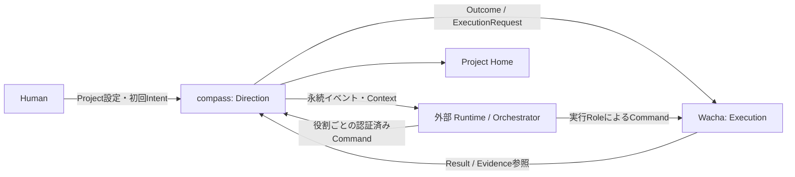

# Architecture

## 所有権

| システム | 正本として所有 | 所有しない |
|---|---|---|
| compass | Project、Intent、Outcome、SuccessCriterion、Research、Evidence、Decision、Evaluation | Story / Task / Claim、Agent Run |
| Wacha | 実行用Outcome（参照・固定snapshot・実行状態）、実行計画、Story / Task、依存、Claim、Review、Acceptance、実行結果 | Mission、成果の最終評価、次のOutcome |
| Runtime / Orchestrator | Agent起動、Role context、モデル・ツール設定、Run、実行並列数、再試行、待機・起床 | Directionの意味と正本、Taskの排他 |

Researcher / Strategist / Evaluatorは外部Runtime上で動く役割であり、compassの常駐Agentではない。compassはAPIによる提案を検証して確定し、ドメインイベントを公開する。



## 単体利用

相手のサービス・DB・認証は任意依存。compassはstandaloneモードで外部の実行記録と証拠を扱い、Wachaはlocal Outcomeと既存Workを扱う。連携時のみWachaのexternal Outcomeがcompassの固定snapshotを参照する。詳細は[単体利用仕様](standalone-and-integration.md)。各製品を自律駆動するRuntimeは引き続き外部責務。

## 初期構成のデフォルト

空のリポジトリではTypeScript strict、Node.jsの実装時点のサポート対象LTS、npm、Next.js App Router（UI + HTTP入口）、PostgreSQL、Prisma、Zod、Vitest、Playwrightを採用する。実装開始時に公式情報・利用環境と互換性を確認し、具体的バージョンをlockfileとREADMEに記録する。これは技術選定の初期案であり、利用可能な既存構成があれば優先する。

```text
src/
  domain/          # 純粋な型・不変条件・状態遷移
  application/     # Command / Query、権限、トランザクション境界
  ports/           # Repository、ExecutionGateway、Clock、EventStore
  infrastructure/  # DB、認証、Wacha adapter
  app/             # UIとHTTP入口。業務判断を置かない
  contracts/       # 入出力スキーマ・バージョン
prisma/            # schema・migration・開発用seed
scripts/           # ローカル実演。Agent Runtimeの実装は禁止
tests/            # unit / integration / contract / e2e
```

domainはWebフレームワーク、ORM、外部APIに依存しない。applicationがportsを使用し、infrastructureが実装する。最初は単一デプロイ・単一DB。ActivityやHomeは同じDBから読む投影でよく、専用検索基盤・イベントソーシングは不要。

## 永続化とイベント

Command実行時に業務データ、Decision等の履歴、Activity、outboxイベントを同一トランザクションで記録する。外部ネットワーク呼び出し中にDBトランザクションを保持しない。

外部Runtimeまたは連携アダプタがoutboxを読み配送する。compassはoutboxの一覧・配信確認APIを提供するが、Agentの起動やRunの再試行を実装しない。ローカルデモでは明示実行するスクリプトで配送を再現する。配送の再試行とAgent Runの再試行は別責務。

外部入力はinboxで冪等に取り込む。配信保証はat-least-onceを前提とし、状態反映を一度に抑える。全履歴をイベントから復元する設計は不要。

## 品質目標

- 保存後の再起動でIntent、評価、未配送イベントが失われない。
- Project間の参照混入をAPIとDBの両方で防ぐ。
- Wacha障害でもProject Homeと過去の判断を閲覧できる。
- 一覧はページングし、Homeはサーバー側で集約する。初期ページサイズ20、最大100。
- フェイクと実接続、最新と古い観測、未測定とゼロを区別する。

## 対象外

Runtime自作、汎用ワークフローエンジン、マイクロサービス分割、Kafka、ベクトルDB、任意コードの評価器、GitHubリポジトリの自動変更は初期実装に含めない。
